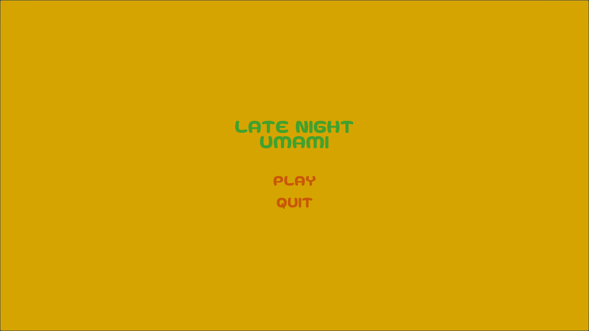
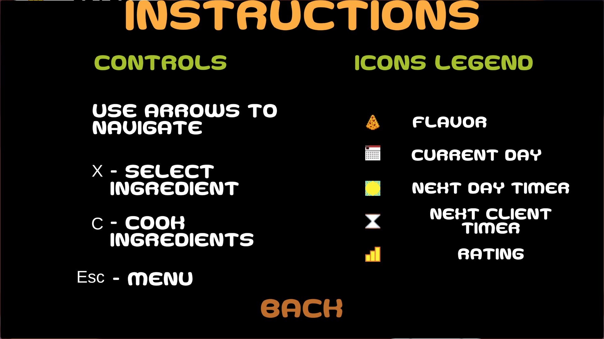
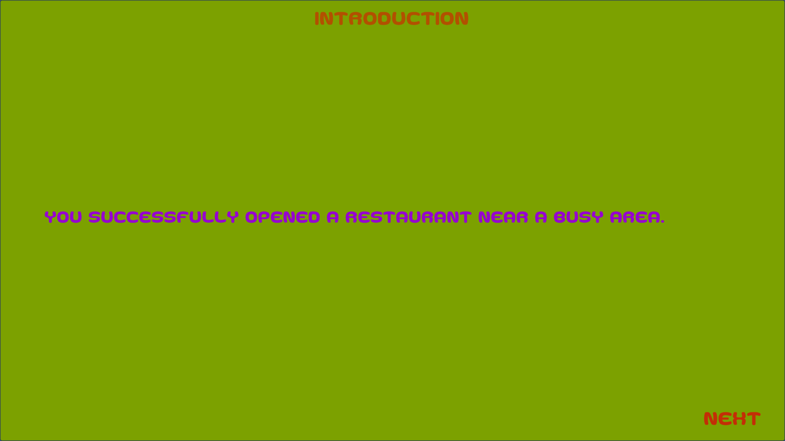
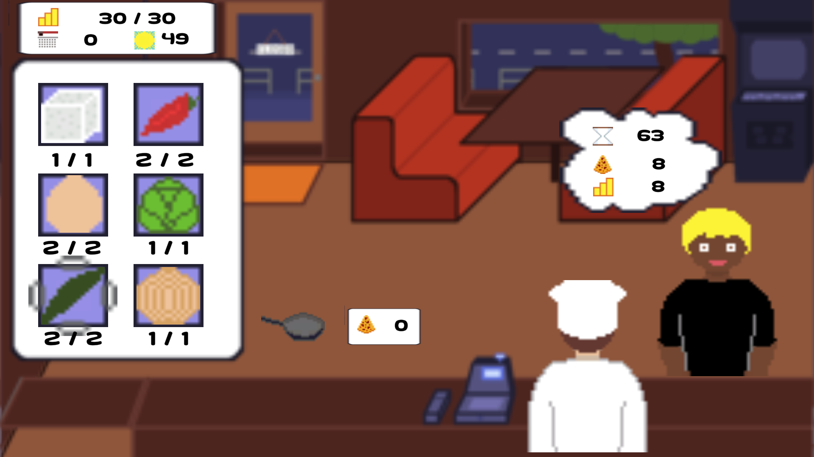

# Late night umami

The game is my submission for the brackeys game jam 2021.1, made in Unity and tested for Windows and Debian.
The theme of the game jam was stronger together. My game fits it as its goal is to serve a late night client ingredients that are more delicious when combined.
The font, used in the game is created by Goma Shin and can be found [here](https://www.dafont.com/goma-cookie-g.font?fpp=200).
Everything else is done by me.

[](https://m00ns7ruck.itch.io/late-night-umami)

# Screenshots

